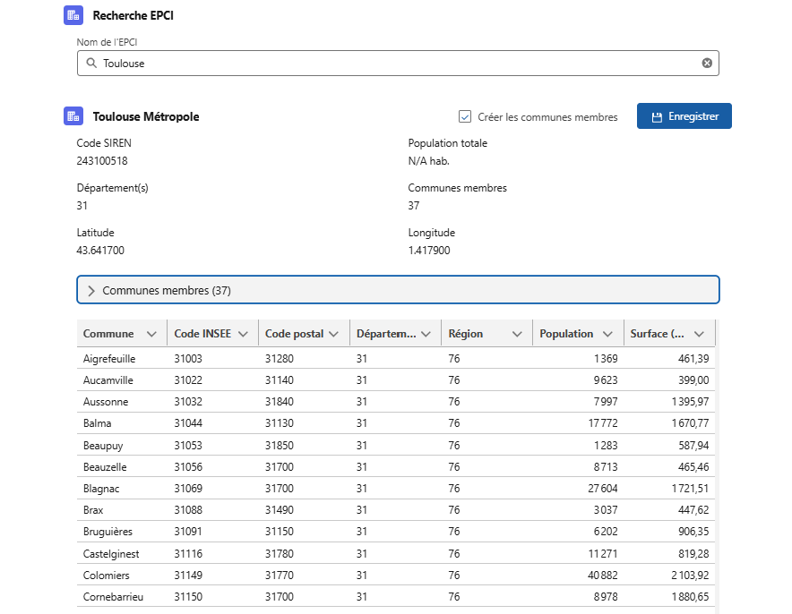

# EPCI — Enrichissement Salesforce via geo.api.gouv.fr

Application Salesforce DX permettant de rechercher des **Établissements Publics de Coopération Intercommunale (EPCI)** via l'API officielle du gouvernement français ([geo.api.gouv.fr](https://geo.api.gouv.fr)), puis d'enregistrer les données enrichies directement dans Salesforce.

[](https://githubsfdeploy.herokuapp.com?owner=Nounem&repo=EPCI&ref=main)

---

## Sommaire

- [Aperçu](#aperçu)
- [Présentation](#présentation)
- [Architecture](#architecture)
- [Objets Salesforce](#objets-salesforce)
- [Composants Apex](#composants-apex)
- [Composant Lightning (LWC)](#composant-lightning-lwc)
- [Prérequis](#prérequis)
- [Installation et déploiement](#installation-et-déploiement)
- [Ajouter le composant dans Salesforce](#ajouter-le-composant-dans-salesforce)
- [Utilisation](#utilisation)
- [Tests](#tests)
- [Structure du projet](#structure-du-projet)

---

## Aperçu



---

## Présentation

Ce projet permet aux utilisateurs Salesforce de :

1. **Rechercher** un EPCI par son nom (saisie partielle acceptée, minimum 2 caractères)
2. **Consulter** les détails d'un EPCI : code SIREN, population, département(s), coordonnées géographiques
3. **Explorer** les communes membres de l'EPCI (jusqu'à 500 communes)
4. **Enregistrer** l'EPCI et ses communes dans des objets Salesforce personnalisés (`EPCI__c` et `Commune__c`)
5. **Associer** un EPCI à un compte (`Account`) Salesforce existant

Les données proviennent de l'API géographique officielle du gouvernement français : `https://geo.api.gouv.fr/epcis`.

---

## Architecture

```
geo.api.gouv.fr (API externe)
        │
        ▼
EpciGeoApiService       ← Couche d'intégration HTTP (callouts)
        │
        ▼
EpciSearchController    ← Couche controller (méthodes @AuraEnabled)
        │
        ▼
epciManager (LWC)       ← Interface utilisateur Lightning
        │
        ▼
EPCI__c / Commune__c    ← Persistance dans Salesforce
```

### Flux de données

1. L'utilisateur saisit un terme de recherche dans le composant `epciManager`
2. Le controller `EpciSearchController` valide la saisie et délègue à `EpciGeoApiService`
3. `EpciGeoApiService` appelle `geo.api.gouv.fr` et désérialise la réponse JSON
4. Les résultats sont affichés dans le composant sous forme de liste déroulante
5. La sélection d'un EPCI charge ses détails complets (dont les coordonnées GPS)
6. L'utilisateur peut charger les communes membres à la demande
7. Un clic sur « Enregistrer » crée ou met à jour les enregistrements via upsert

---

## Objets Salesforce

### `EPCI__c` — Établissements Publics de Coopération Intercommunale

| Champ | Type | Description |
|-------|------|-------------|
| `Name` | Texte | Nom de l'EPCI |
| `Code_EPCI__c` | Texte (9) | Code SIREN — **clé externe** pour l'upsert, unique |
| `Population_Totale__c` | Nombre | Population totale de l'EPCI |
| `Codes_Departements__c` | Texte | Codes des départements concernés |
| `Nombre_Communes__c` | Nombre | Nombre de communes membres |
| `Localisation__c` | Localisation | Coordonnées GPS (latitude/longitude, 6 décimales) |
| `Date_Enrichissement__c` | Date/Heure | Horodatage de la dernière synchronisation |
| `Account__c` | Lookup (Account) | Compte Salesforce associé (optionnel) |
| `Statut__c` | Liste de sélection | Statut de l'enregistrement |

### `Commune__c` — Communes membres

| Champ | Type | Description |
|-------|------|-------------|
| `Name` | Texte | Nom de la commune |
| `Code_INSEE__c` | Texte | Code INSEE — **clé externe** pour l'upsert, unique |
| `Code_Postal__c` | Texte | Code postal |
| `Population__c` | Nombre | Population de la commune |
| `Surface__c` | Nombre | Surface en km² |
| `Code_Departement__c` | Texte | Code du département |
| `Code_Region__c` | Texte | Code de la région |
| `EPCI__c` | Lookup (EPCI__c) | Référence vers l'EPCI parent |

---

## Composants Apex

### `EpciGeoApiService`

Service d'intégration HTTP vers `geo.api.gouv.fr`. Toutes les méthodes sont `public static`.

| Méthode | Signature | Description |
|---------|-----------|-------------|
| `searchByNom` | `List<EpciWrapper> searchByNom(String nom)` | Recherche des EPCIs par nom (max 10 résultats) |
| `getByCode` | `EpciWrapper getByCode(String code)` | Détail complet d'un EPCI par son code SIREN |
| `getCommunesByCode` | `List<CommuneWrapper> getCommunesByCode(String code)` | Liste des communes d'un EPCI (max 500) |

**Classes internes :**

- `EpciWrapper` — DTO avec `@AuraEnabled` : `code`, `nom`, `populationTotale`, `departements`, `nombreCommunes`, `latitude`, `longitude`
- `CommuneWrapper` — DTO avec `@AuraEnabled` : `code`, `nom`, `codePostal`, `population`, `surface`, `codeDepartement`, `codeRegion`
- `EpciApiException` — Exception métier pour les erreurs d'appel HTTP

---

### `EpciSearchController`

Controller Apex exposant des méthodes `@AuraEnabled` au composant LWC.

| Méthode | Paramètres | Description |
|---------|-----------|-------------|
| `searchEpci` | `String nom` | Recherche avec validation (min. 2 caractères) |
| `getEpciDetail` | `String code` | Détails complets d'un EPCI |
| `getCommunes` | `String code` | Communes membres d'un EPCI |
| `saveEpci` | nom, code, populationTotale, departements, nombreCommunes, latitude, longitude, accountId | Upsert de l'objet `EPCI__c` |
| `saveCommunes` | `String epciId`, `String communesJson` | Upsert en masse des `Commune__c` |

La méthode `saveEpci` utilise `Code_EPCI__c` comme clé externe pour éviter les doublons. `saveCommunes` utilise `Code_INSEE__c`.

---

## Composant Lightning (LWC)

### `epciManager`

Composant Lightning Web Component configurable sur n'importe quelle page Lightning (App Page, Record Page, Home Page).

**Fonctionnalités :**

- Barre de recherche avec débouncé de 300 ms et minimum 2 caractères
- Liste déroulante des résultats avec population et département(s)
- Fiche détail de l'EPCI sélectionné (code, population formatée fr-FR, coordonnées GPS)
- Section « Communes membres » repliable, chargée à la demande, affichée dans un tableau Lightning avec scroll
- Bouton « Enregistrer l'EPCI » avec option de création en masse des communes
- Indicateurs de chargement (spinner) pour chaque opération asynchrone
- Notifications toast pour les succès et erreurs
- Lien automatique au compte (`Account`) si le composant est placé sur une fiche Account

**Colonnes du tableau des communes :**

| Colonne | Champ source |
|---------|-------------|
| Commune | `nom` |
| Code INSEE | `code` |
| Code postal | `codePostal` |
| Département | `codeDepartement` |
| Région | `codeRegion` |
| Population | `population` (formatée fr-FR) |
| Surface (km²) | `surface` (2 décimales) |

---

## Prérequis

- **Salesforce CLI** (`sf` ou `sfdx`) — [Guide d'installation](https://developer.salesforce.com/docs/atlas.en-us.sfdx_setup.meta/sfdx_setup/sfdx_setup_intro.htm)
- **API version** : 66.0 minimum
- **Édition Salesforce** : Developer Edition, Sandbox ou Production avec accès aux objets personnalisés et aux callouts HTTP
- **Accès réseau** : l'org Salesforce doit pouvoir atteindre `https://geo.api.gouv.fr` (le Remote Site Setting est inclus dans le projet)

---

## Installation et déploiement

### 1. Cloner le dépôt

```bash
git clone <url-du-dépôt>
cd EPCI
```

### 2. Authentifier l'org cible

```bash
# Org de production ou sandbox
sf org login web --alias mon-org

# Ou scratch org
sf org create scratch --definition-file config/project-scratch-def.json --alias epci-scratch --set-default
```

### 3. Déployer les métadonnées

```bash
# Déploiement complet
sf project deploy start --source-dir force-app --target-org mon-org

# Ou push sur une scratch org
sf project deploy start
```

### 4. Vérifier le Remote Site Setting

Le Remote Site Setting `Geo_API_Gouv` (url : `https://geo.api.gouv.fr`) est inclus dans le déploiement. Vérifier qu'il est bien actif dans **Configuration → Paramètres de sécurité → Sites distants**.

### 5. Ajouter le composant à une page Lightning

Voir la section [Ajouter le composant dans Salesforce](#ajouter-le-composant-dans-salesforce) ci-dessous.

---

## Ajouter le composant dans Salesforce

Le composant `epciManager` peut être placé sur trois types de pages Lightning. Le comportement change légèrement selon l'emplacement choisi.

### Option 1 — Page d'application (App Page)

Idéal pour un accès rapide depuis la barre de navigation Salesforce.

1. Aller dans **Configuration → Interface utilisateur → Lightning App Builder**
2. Cliquer sur **Nouveau**, choisir **Page d'application**, puis **Page à une région** (ou la mise en page souhaitée)
3. Donner un nom à la page (ex. : *Recherche EPCI*)
4. Dans le panneau de gauche, rechercher **EPCI Manager** dans la liste des composants
5. Glisser-déposer le composant dans la zone principale
6. Cliquer sur **Enregistrer**, puis **Activer**
7. Dans la fenêtre d'activation, cocher **Ajouter à la navigation de l'application** pour faire apparaître le composant dans le menu

> Dans ce mode, le composant fonctionne en autonome. Les EPCIs enregistrés ne seront pas automatiquement liés à un compte.

---

### Option 2 — Page d'accueil (Home Page)

1. Aller dans **Configuration → Interface utilisateur → Lightning App Builder**
2. Sélectionner la **Page d'accueil** existante (ou en créer une nouvelle)
3. Glisser le composant **EPCI Manager** dans la mise en page
4. Enregistrer et activer

---

### Option 3 — Fiche de compte (Record Page — Account) *(recommandé)*

Lorsque le composant est placé sur une fiche Account, il récupère automatiquement l'identifiant du compte et lie l'EPCI enregistré à ce compte via le champ `Account__c`.

1. Naviguer vers un enregistrement **Compte** dans Salesforce
2. Cliquer sur l'icône **Engrenage (⚙)** en haut à droite → **Modifier la page**
3. Dans le panneau de gauche, rechercher **EPCI Manager**
4. Glisser le composant dans la section souhaitée de la fiche (ex. : colonne de droite ou onglet dédié)
5. Cliquer sur **Enregistrer**, puis **Activer → Attribuer comme page par défaut de l'organisation** (ou par profil)

> C'est l'emplacement recommandé : l'EPCI sauvegardé sera directement rattaché au compte consulté.

---

## Utilisation

1. Saisir au moins 2 caractères du nom d'un EPCI dans la barre de recherche
2. Sélectionner un EPCI dans la liste de résultats
3. Consulter les informations détaillées affichées automatiquement
4. (Optionnel) Cliquer sur « Communes membres » pour charger et afficher les communes
5. Cliquer sur **Enregistrer l'EPCI** pour créer ou mettre à jour l'enregistrement `EPCI__c`
6. Cocher « Créer les communes membres » pour enregistrer également toutes les communes de l'EPCI

Les enregistrements sont créés en mode **upsert** : si un EPCI ou une commune existe déjà (même code SIREN ou code INSEE), ses données sont mises à jour plutôt que dupliquées.

---

## Tests

Les tests unitaires couvrent les deux classes Apex principales.

```bash
# Lancer tous les tests Apex
sf apex run test --target-org mon-org --code-coverage --result-format human

# Lancer uniquement les tests EPCI
sf apex run test --class-names EpciGeoApiServiceTest EpciSearchControllerTest --target-org mon-org
```

| Classe de test | Méthodes | Couverture cible |
|----------------|----------|-----------------|
| `EpciGeoApiServiceTest` | 5 méthodes | EpciGeoApiService |
| `EpciSearchControllerTest` | 6 méthodes | EpciSearchController |

Les tests utilisent des mocks HTTP (`HttpCalloutMock`) pour simuler les réponses de `geo.api.gouv.fr` sans appel réseau réel.

---

## Structure du projet

```
EPCI/
├── README.md
├── sfdx-project.json
├── .forceignore
├── config/
│   └── project-scratch-def.json
└── force-app/
    └── main/
        └── default/
            ├── classes/
            │   ├── EpciGeoApiService.cls          # Service HTTP geo.api.gouv.fr
            │   ├── EpciGeoApiService.cls-meta.xml
            │   ├── EpciGeoApiServiceTest.cls       # Tests unitaires du service
            │   ├── EpciGeoApiServiceTest.cls-meta-xml
            │   ├── EpciSearchController.cls        # Controller @AuraEnabled
            │   ├── EpciSearchController.cls-meta.xml
            │   ├── EpciSearchControllerTest.cls    # Tests unitaires du controller
            │   └── EpciSearchControllerTest.cls-meta.xml
            ├── lwc/
            │   └── epciManager/
            │       ├── epciManager.html            # Template Lightning
            │       ├── epciManager.js              # Logique du composant
            │       ├── epciManager.css             # Styles
            │       └── epciManager.js-meta.xml     # Configuration (targets, API version)
            ├── objects/
            │   ├── EPCI__c/                        # Objet EPCI + 10 champs
            │   └── Commune__c/                     # Objet Commune + 7 champs
            └── remoteSiteSettings/
                └── Geo_API_Gouv.remoteSite-meta.xml  # Autorisation appel geo.api.gouv.fr
```

---

## Ressources

- [API geo.api.gouv.fr — Documentation officielle](https://geo.api.gouv.fr/decoupage-administratif/epcis)
- [Salesforce DX Developer Guide](https://developer.salesforce.com/docs/atlas.en-us.sfdx_dev.meta/sfdx_dev/sfdx_dev_intro.htm)
- [Lightning Web Components Developer Guide](https://developer.salesforce.com/docs/component-library/documentation/en/lwc)
- [Apex Developer Guide — HTTP Callouts](https://developer.salesforce.com/docs/atlas.en-us.apexcode.meta/apexcode/apex_callouts_http.htm)
